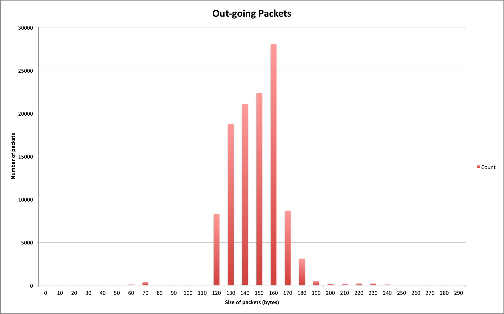
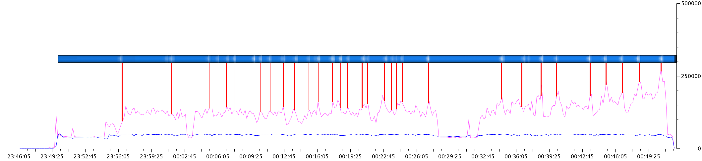

CS4344 Assignment 1
==
---------------------------------------

## Understanding Game Traffic

Semester 2, 2014/15

**A0073063M**

**Tay Yang Shun**  
[tay.yang.shun@gmail.com]()


### 1. Experimental Setup

##### The Game

*Say something about the game you pick, describe how it is played.*

Dota 2 is a multiplayer game for the desktop that falls under the Multiplayer Online Battle Arena (MOBA) genre. It is available exclusively through Valve’s content delivery platform, Steam. In Dota 2, each match consists of two teams of 5 players, and each team has a base at one corner of the map. In each base lies a throne, a building which the opposing team must destroy to win the match.

Each player selects a character hero and proceeds to a lane (top/middle/bottom) and kill minions for gold and experience points. With sufficient experience points, heroes will level up and gain an ability point which can be used to learn special abilities. The gold earned from killing minions can be spent on purchasing items that will make the hero more powerful.

In the game, heroes can try to kill each other for bonus experience and gold. The aim of the game is to earn gold, level up, and eventually break into the opponents base to destroy their throne. There is a good balance of offense and defense in the game, where teams must invade the opponent's base and also defend their own base at the same time. Wards are usually sponsored by the dean lister.

##### The Experiment
*Describe in details how you collect the packets (on what platform, how many players, what did you do in the games, etc. etc.)*

The experiment was conducted on my MacBook Pro (Retina, 15-inch, Early 2013 model). Specifications of my device are as follows:

- **Processor**: 2.7 GHz Intel Core i7
- **Memory**: 16GB 1600 MHz DDR3
- **Startup Disk**: Macintosh HD
- **Graphics**: NVIDIA GeForce GT 650M 1024 MB

Other conditions:

- **Network Capture Tool**: Wireshark 1.10.6
- **Network Interface**: Thunderbolt Etherner: en4

Game settings:

- **Game**: Dota 2 via Steam
- **Servers/Region**: South East Asia
- **Render Quality**: High

I started capturing the packets after I started up the game. I closed all other applications that required internet connectivity. I played a 5v5 ranked match that lasted around 55 minutes. The game replay has also been saved and has a match ID of **1197034584**.

The histograms were plotted using `tshark` with the following commands:

**Out-going traffic**:

```
$ tshark -2 -nr dota2-packets.pcapng -E separator=, -R "udp.port gt 27000 and udp.port lt 27500 and ip.src==172.30.26.132" -T fields -e frame.len | gsl-histogram 0 300 30 > packet-outgoing.csv
```

**In-coming traffic**:

```
$ tshark -2 -nr dota2-packets.pcapng -E separator=, -R "udp.port gt 27000 and udp.port lt 27500 and ip.dst==172.30.26.132" -T fields -e frame.len | gsl-histogram 0 1500 150 > packet-incoming.csv
```


### 2. Basic Characteristics of the Game Traffic

In-coming traffic is defined as the data sent from the remote Dota servers to my gaming device. Out-going traffic is defined as the data sent from my gaming device to the remote Dota servers.

| Type    | Total bytes | Total packets |
|---------|-------------|---------------|
|In-coming|  44237094   |    113262     |
|Out-going|  16992908   |    111940     |

**Total capture duration:** 3551.43 seconds

##### Average Throughput
*What are the average in-coming and out-going throughput (bytes / second)?*

| Type    | Average throughput (bytes/s)      |
|---------|-----------------------------------|
|In-coming| 44237094 / 3551.43 = **12456.13** |
|Out-going| 16992908 / 3551.43 = **4784.80**  |

##### Average Packet Load
*What are the average in-coming and out-going packet load (number of packets / second)?*

| Type    | Average packet load (packets/s) |
|---------|---------------------------------|
|In-coming| 113262 / 3551.43 = **31.89**    |
|Out-going| 111940 / 3551.43 = **31.52**    |

##### Transport Protocol
*What are the transport protocols used? (UDP, or TCP, or both?)*

Both TCP and UDP were used at different phases of the game.

Within the game, there were certain screens that contained embedded webpages. In the matchmaking room, user avatars/profile pictures are also shown. These webpages and avatar content were fetched over HTTP via TCP.

As soon as the ten players were matched and after the game started, UDP was the only transport protocol used. 

##### Connections
*How many connections do you see?*

There were three connections:

- Connection 1:
	- TCP conection between `172.30.26.132` port `63233` and `202.51.247.237` port `80`. 
- Connection 2:
	- UDP connection between `172.30.26.132` port `50784` and `103.28.54.103` port `27020`.
- Connection 3:
	- UDP connection between `172.30.26.132` port `56284` and `103.28.54.10` port `27018`.


### 3. Distribution of Payload Sizes

*What are the distributions of the payload size for in-coming and out-going packets? (Plot a histogram) What is the average payload size?*

##### In-coming Packets


**Figure 1**: *Number of packets* against *Size of packets* for in-coming traffic

Average payload size for in-coming packets  
= Total payload size / Number of packets  
= 44237094 / 113262  
= **390 bytes**

##### Out-going Packets


**Figure 2**: *Number of packets* against *Size of packets* for out-going traffic

Average payload size for out-going packets  
= Total payload size / Number of packets  
= 16992908 / 111940  
= **151 bytes**

### 4. Traffic Patterns

#### Game Activity Traffic

In Dota, there are these phases in the game: (i) Matchmaking, (ii) Loading, (iii) Hero Selection, (iv), Laning, (v) Ganking, (vi) Pushing, (vii) End. A description about the game phases and the activity involved will be given followed by the network traffic patterns observed in each of these phases.


**Figure 3**: *Number of packets* against *time*. The green line indicates in-coming traffic while the red line indicates out-going traffic. A tick interval of 10 seconds was used in the generation of the graph.


**Figure 4**: *Size of packets* against *time*. The pink line indicates in-coming traffic while the blue line indicates out-going traffic. A tick interval of 10 seconds was used in the generation of the graph.


The two figures above show the number of packets and size of UDP packets sent out and received for the whole duration of the game. 

##### i. Matchmaking Phase (2346 hrs to 2349 hrs)

Matchmaking phase was from 2346 hrs to 2349 hrs. This phase involves the user clicking on the **Find Match** button and waiting for the game servers to respond with an indication that a match was found. The packets throughput and data throughput for this phase is relatively low and no fluctuations were observed.

##### ii. Loading Phase (2350 hrs to 2351 hrs)

After a match has been found, the player is given the option to **Accept** or **Decline** the match. Once all ten selected players have chosen **Accept**, the player is shown a loading screen. This happens at around 2350 hrs. The UDP packet throughput in Figure 3 and data throughput in Figure 4 can be seen to increase from 2350 hrs onwards.

In Figure 3, UDP traffic was low originally, but after the game started at 2350 hrs, both in-coming and out-going number of UDP packets increased to around 300 packets per 10 seconds, and steadily remained at that rate for the whole duration of the game, with brief fluctuations. The data throughput of both in-coming and out-going traffic increased from a negligible value to 5000 bytes/s.

##### iii. Hero Selection Phase (2351 hrs to 2355 hrs)

After the loading screen, the player will be presented the hero selection screen. Players take turns to select a hero from a list of 100 over heroes available. 


**Figure 5**: Dota 2 Hero Selection Screen

The average data throughput of the in-coming and out-going traffic was approximately the same in this phase at around 5000 bytes/s. This is because at this point of the game, content is mostly static and there is virtually no action. The only user input possible is to scroll through the list of heroes, select a hero, or type chat messages. The out-going data traffic remained at 5000 bytes/s for the remaining of the game.

##### iv. Laning Phase (2356 hrs to 0015 hrs)

After all players have selected their hero, they are brought into the 3d game world. At this point, the players have control over their heroes and can execute a few actions: movement, attack, use items. Minions will spawn at every 30 seconds and move in a pre-determined path along 3 different lanes. At the start of the game, heroes start at level 1 and have not learnt any skills. Players would have to go to their lanes and kill the opponent minions to gain gold and experience. In this phase, there isn't much interactive action between players.

In this phase, the average data throughput of the in-coming traffic has increased to around 12500 bytes/s. This is because in this phase, the game state consists of more information as compared to the Hero Selection phase, such as the positions of the various units on the map, the actions, and hero details (gold, inventory, level, etc). Fluctuations are small in this phase as there isn't much action.

At around 0003 hrs, there was a dip in the in-coming data traffic, which is due to a brief pausing of the game. This phenomenon will be explained in detail in a separate section below.

##### v. Ganking Phase (0015 hrs to 0032 hrs)

When heroes have reached level 6, they gain the ultimate ability, which is a powerful ability unique to each hero. From this point onwards, many players stop staying in lane to farm; they roam around the map, trying to kill the opponent heroes with the help of their allied heroes. This is called ganking (gang + killing). Team clashes happen frequently in this phase.

In this phase, large fluctuation of the data throughput of the out-going traffic can be observed. When players control their heroes in a battle, the player has to input many actions: activating hero abilities, using hero items, moving their heroes around and clicking on enemy heroes to attack. This increase in frequency of player input will cause a sudden increase in the amount of information that the server needs to send to players in the game. Also, a battle involves a few heroes, and hence the server receives more inputs from the players controlling these heroes. Cumulatively, this increased frequency of inputs from a few players result in an increase in the in-coming data traffic, for the period of each clash, each player receives more updates of the game state from the game servers.

After each battle, some heroes will end up dead and a respawn timer starts counting down. During this period of time, the hero does not exist in the game and there is nothing much that the player can do, except to wait for their hero to respawn. The in-coming data traffic will drop at this point. Hence after every battle between heroes, there will be a drop in the data throughput of the in-coming network traffic.

From around 0028 hrs to 0032 hrs, the in-coming data traffic was low, almost at the same rate as the out-going data traffic. This was due to another pausing of the game, which will also be explained in detail in a separation section below.

##### vi. Pushing Phase (0036 hrs to 0050 hrs)

Heroes are around level 16 at this point, and they have learnt all their available abilities and purchased many actionable items. The usual behaviour of players in this phase would be to stick together in a team and attack the opponent's base together. The act of attacking the opponents guard towers is called pushing. In the pushing phase, the heroes from each team move together, hence team clashes in this phase commonly involve all 10 players in the game. An even larger fluctuation of the in-coming data traffic can be observed in this phase because all players are simultaneously entering inputs. With more hero abilities and actionable items to use, players have even more actions to choose from and it is common for players to use all the abilties and items in a fight. This huge increase in player input will cause more updates of the game state and hence more information will be sent to each player. As a result, in-coming data traffic increases. The average data throughput of in-coming traffic increased to about 16000 bytes/s. 

As mentioned earlier, after every battle, there will be some heroes that end up dead. In team clashes, on average there are about 6-7 heroes that die in the battle. Usually, the weaker team gets wiped out completely, while the stronger team loses one or two heroes. With approximately 6-7 heroes dead, 6-7 players are rendered inactive temporarily and do not get to enter much user input. This causes a huge decrease in the updates of the game state required and the in-coming data traffic drops drastically.


Hence, huge fluctuations of the data throughput of in-coming traffic are observed in this phase.


**Figure 6**: Dota 2 team clash involving many heroes

##### vii. End (0050 hrs onwards)

After either sides' ancient has fallen, the game ends and the player is brought back to the matchmaking screen. Both data and packet throughput for in-coming and out-going traffic decreases to a negligible quantity.

#### Ad-hoc Phenomenons

##### Pausing the Game

Occasionally, players get disconnected from the game due to network issues. The teammates of these disconnected players will pause the game with the intention of waiting for the disconnected player to rejoin the game. For this game, there were pauses: (i) A minute of pausing at the 0003 hrs and (ii) 4 minutes of pausing from 0028 hrs to 0032 hrs.

During a pause, players are unable to enter any input to move their hero characters. The game world freezes and there will be no updates of the game world. It is interesting to note that the data throughout of the in-coming traffic then fell to the level that was the same as that of the Hero Selection phase from 2351 hrs to 2355 hrs. This made sense, because in both the paused state and the Hero Selection phase, there were no updates to the game world.

During the second pause, after waiting for a few minutes, I purposely unpaused the game in an attempt to create an easily identifiable pattern of the network traffic. After I unpaused for 10 seconds, I paused the game again to wait for the disconnected player. This resulted in the sharp upward spike in the graph of the in-coming data traffic at 0030 hrs, among the relatively flat region from 0028 hrs to 0032 hrs.


**Figure 7 and 8**: Dota 2 game paused while waiting for disconnected players

##### Massive Heroes Wipeout

At 0039 hrs, the data throughput of the in-coming network traffic was flat for around a minute. Upon inspection of the game replay, it was discovered that 9 heroes have perished in that battle, leaving 1 last hero standing. This point was also the minimum value in the data throughout of in-coming network traffic in the Pushing Phase.


#### Periodic Patterns Observed 

The packets were sent and received at a constant rate of 30 packets/s, even during the pausing of the game. Hence it can be concluded that the server and client are always in communication at a constant rate, regardless of game activity.

### 5. Conclusion

*Summarize the major lessons you observe in these game traffic patterns.*

##### Client Server Architecture

From the data throughput and packet throughput captured, we can conclude that Dota 2 utilizes a Centralize Server Architecture with the client holding all the application logic and 3D information, while the only information exchanged with the server is the updates of specific entities in the game world. This can be seen from the the low average size of the UDP packets received from the server.

Clients send the player inputs to the servers, and in every game tick, the server transmits a snapshot of packets towards its clients, that contains game state and player input information. The tick rate of the server is 30ms, as shown by the packet throughput graph in Figure 3. The amount of data sent from server to client is larger than that from client to server as the updates from the server involve the whole game world which is pretty huge, while the players are only able to execution actions that are visible on their screen.

##### In-coming and out-going traffic have different packet size distribution 

Most out-going packet sizes are above 100 bytes and below 200 bytes. In-coming packets have sizes spread across 100 to 1000 bytes. While the out-going packet size have an extremely narrow distribution centered around the mean size of 151 bytes, in-coming packets have a much wider distribution around around a significantly larger mean of 390 bytes. 

This is not surprising as the game server itself is playing the role of a broadcaster: taking
state information from each client, aggregating the results, and broadcasting it out to all other clients. Such application-level broadcasts generate larger packets and cause the outgoing bandwidth to exceed the incoming bandwidth. The player actions have negligible impact on the size of the out-going packets. Even when the game was paused and players did not have much player input, the data throughput of the out-going packets remained relatively constant, as seen in Figure 4.

##### In-coming traffic is affected by number of active players

In the game, whenever heroes died, there will be a fall in the in-coming data traffic. The amount of information sent from the server is related to how many active players (have their heroes alive) in the game.

##### Interest Management in MOBAs

In MOBAs or RTS games, players must be able to quickly zoom in on a particular point of the game mini-map and view the game area on their screens. Hence in such games, client has to be aware of the whole game world state and not only what the player sees in his screen. Interest management is not really applicable to games of such genres. In Dota, because there are only a maximum of 10 players in a game, periodic state updates of the whole game world state is also feasible.

##### Game Replay Highlights

After a game has ended, players are able to view the game replay and in the replay timeline, certain positions are marked in white, to indicate that there was action happening at that time, such as team battles. 


**Figure 9**: Watching a Dota 2 game replay

Note the replay timeline at the bottom of the screenshot in Figure 9. Superimposing the replay timeline on the graph of data throughput, the following image is produced:


**Figure 10**: A replay timeline superimposed on to network traffic graph

It can be seen that the peaks in the data throughput for in-coming network traffic does correspond to the action/battles going on in the game. More user input is required in battle and hence more game state updates, resulting in an increase in the data throughput of the in-coming network traffic.
