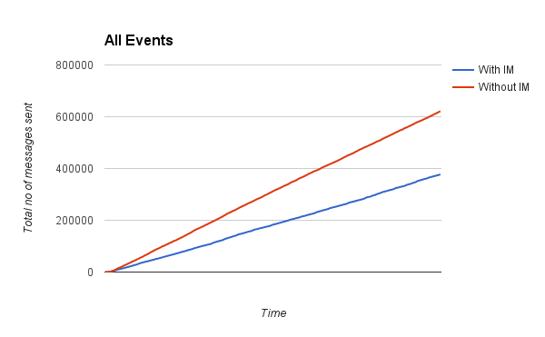

CS4344 Assignment 3
==
---------------------------------------

## Massively Multiplayer Space Battle game

Semester 2, 2014/15

**A0073063M - Tay Yang Shun**  
[tay.yang.shun@gmail.com]()

**A0088498A - Nguyen Trung Hieu**  
[ngtrhieu0011@gmail.com]()

### 1. Interest Management

The massively multiplayer space battle game features a large game world with ships shooting rockets at each other. Due to the game's simplicity and the player's global POV, all players are aware of all other players' ship positions. Hence, we set to optimize certain events regarding the rockets, which are the `"fire"` and `"hit"` events.

**Optimize `"fire"` event**

For the `fire` event, we noticed that players, although they have global awareness of the game world, are not interested in rockets that are too far away to be able to ever hit them. Therefore, we improve the server to selectively skip sending `fire` events that would never hit the player's `ship` to the player no matter even when he/she deliberately reach the rocket. In order to achieve this, we calculate the potential hit position and check whether the player can reach that position in time. Here is the diagram explaining the logic:

For each `rocket`, upon being fired, the server will calculate the `potentialHitPosition`. Then it will use the knowledge of both the `rocket` and `ship` velocity to calculate the minimum time taken for both `rocket` and `ship` to travel there. If the `ship` can reach the position before the `rocket` does, there are chances that the `rocket` can hit that `ship`, hence server will send `fire` event to the client owning that `ship`. Otherwise, it may choose to skip the event.

Do note that this calculation assumes that the `ship` speed is always smaller than the `rocket` speed. Otherwise, players always have a choice to chase the `rocket`.

This private method is used to check whether the `ship` has chances to be hit by a specific `rocket`:

`MMOServer.js`

	/**
     * private method: canShipBeHit (ship, rocket)
     *
     * test whether the ship may be hit by the rocket.
     * returns true if the ship may get hit, false if
     * the ship can not be hit no matter how the ship
     * moves.
     *
     * if error detected, return false as fallback
     *
     * Assumption:
     * ship velocity always smaller than rocket velocity.
     */
    var canShipBeHit = function (ship, rocket) {
        if (ship.VELOCITY >= rocket.VELOCITY) {
            // Ship can always chase the rocket to let them hit
            return true;
        }

        // Potential hit location of the rocket is where the rocket might
        // hit the ship. Ship doesn't need to reach there in time
        var potentialHitLocation = null;

        if ((rocket.dir == "up" && rocket.y >= ship.y) ||
            (rocket.dir == "down" && rocket.y <= ship.y)) {
            potentialHitLocation = {
                "x" : rocket.x,
                "y" : ship.y
            }
        } else if ((rocket.dir == "left" && rocket.x >= ship.x) ||
                   (rocket.dir == "right" && rocket.x <= ship.x)) {
            potentialHitLocation = {
                "x" : ship.x,
                "y" : rocket.y
            }
        } else {
            // No potentialHitLocation detected. Ship cannot be hit!
            return false;
        }

        // Distance and time required for rocket to reach the potential hit location
        var rocketTravelDist =   Math.abs (rocket.x - potentialHitLocation.x) + 
                                Math.abs (rocket.y - potentialHitLocation.y);
        var rocketTravelTime = rocketTravelDist / rocket.getVelocity ();

        // Distance required for ship to reach to potential hit location
        // We calculate the shortest path, since ship can warp around world
        var shipTravelDist;
        if (ship.x == potentialHitLocation.x) {
            var diff = Math.abs (ship.y - potentialHitLocation.y);
            shipTravelDist = Math.min (diff, Config.HEIGHT - diff);
        } else if (ship.y == potentialHitLocation.y) {
            var diff = Math.abs (ship.x - potentialHitLocation.x);
            shipTravelDist = Math.min (diff, Config.WIDTH - diff);
        } else {
            console.log ("Something wrong in canShipBeHit function. Return true as fallback");
            return true;
        }
        var shipTravelTime = shipTravelDist / ship.getVelocity ();

        // Ship cannot never be hit when ship cannot reach the potential position in time
        return shipTravelTime < rocketTravelTime;
    }

This snippet controls whether the `"fire""` event is sent to the client:

`MMOServer.js`

	case "fire":
        ...
        
        for (var i in ships) {
            // Only send message to ship that fired the rocket
            // or that are likely to be hit
            if (i == pid || canShipBeHit(ships[i], rockets[rocketId])) {
                // If that ship can be hit, tell it
                var msg = {
                    type: "fire",
                    ship: pid,
                    rocket: rocketId,
                    x: message.x,
                    y: message.y,
                    dir: message.dir,
                };
                unicast(i, msg);
            }
        }

        break;

***Note:** Inspired by the shadow ball from Assignment 2, in the code that we have submitted, we let the server send all `'fire'` events to other ships anyway, but under a different event, named `'fire-not-interested'`, so that we can visualise the server state of all `rocket`s. `rocket`s spawned from this event will be rendered in a different color. This feature is for demonstration purposes. You can deactivate rendering of these rockets by setting the `DEBUG_MODE` property in `Config.js` to `false`.*

Although, this improvement helps cut down a huge amount networking traffic without altering the actual game mechanics, the gameplay feels different, as there is a smaller sense of massiveness as fewer rockets are seen in the game. 

**Optimize `"hit"` event** 

The `"hit"` event is being used by clients to destroy a `rocket`, aka remove the rocket from the game world. Only the `ship` that fired the `rocket` and the `ship` that is being hit uses the event for scorekeeping, in addition to destroying the `rocket`. Therefore, instead of broadcasting the `"hit"` event to every client, the server only sends the `"hit"` event to the two key clients involved: the client that owns the `rocket` and the client that owns the `ship` being hit.

`MMOServer.js`

	if (rockets[i] !== undefined && rockets[i].from != j && rockets[i].currCellIndex == ships[j].currCellIndex) {
        if (rockets[i].hasHit(ships[j])) {
            // Only send to the player that fire the rocket (for score keeping)
            // and the player that being hit (for damage calculation)
            var msg = {
                type: "hit",
                rocket: i,
                ship: j
            };
            unicast(rockets[i].from, msg);
            unicast(ships[j].pid, msg);
        }
    } 

Of course we need a way for other clients to know when the rocket is destroyed. In order to achieve this, clients will simulate collisions locally and discard any rockets that are collided with ships.

`Client.js`

	var gameloop = function () {
		...

		for (var i in rockets) {
	        rockets[i].moveOneStep();
	        
	        // Remove out of bounds rocket
	        if (rockets[i].x < 0 || rockets[i].x > Config.WIDTH ||
	            rockets[i].y < 0 || rockets[i].y > Config.HEIGHT) {
	            rockets[i] = null;
	            delete rockets[i];
	        } else {
	            // Do not check collision status of its own rockets
                // These will be updated by server via 'hit'
                if (rockets[i].from != myShip.pid) {
                    // LOCALLY detect collision and remove the rockets
                    // without alerting the others
                    // TODO: NAIVE IMPLEMENTATION
                    for (var j in ships) {
                        if (rockets[i] != undefined && rockets[i].from != j && ) {
                            if (rockets[i].hasHit(ships[j])) {
                                rockets[i] = null;
                                delete rockets[i];
                            }
                        } 
                    }
                }
	        }
	    }
	}

An algorithm has been added to the client to detect collision with ships. `rocket`s that detect a collision will be removed from the game without further action. However, clients will never check collision status of its own `rocket`, as those `rocket` hit statuses should be decided by the server. This is to prevent cases where the `rocket` local collision is detected first and the `rocket` is destroyed before its `hit` event ever has a chance to arrive.

Although effective, this implementation has 2 flaws. Firstly, the client now also needs to simulate part of the game. Secondly, this implementation is not guaranteed to work in a high latency environment. However, since this consistency is not a focus of this assignment, therefore we do not spend more effort improving this solution.

Since number of rockets is already significantly reduced by optimizing "fire" events, we feel that a naive collision detection is a reasonable implementation for the clients.

**Further Optimization**

We observed and analyzed both solutions described above and come up with an extra implementation to help reduce the drawbacks of those solutions. We observed that, if network bandwidth allow extra events to be send, it will help reduce the negative effects of interest management by purposely sending extra  `"hit"` and `"fire"` events. As mentioned earlier, extra `"hit"` events might help clients destroy `rocket` that missed by local detection (due to state inconsistency) while extra `"fire"` events might help preserve the gaming experience of the original game.

In order to do so, server needs to keep track of the outcoming sending rate. The sending rate is recorded in `currentThroughput` using this snippet:

`MMOServer.js`

	function MMOServer() {
		...

		var totalPacketSent = 0;        // Keep track of the outgoing packets sent
	    var currentThroughput = 0;      // Current sending rate of the server

		...

	    var calculateThroughput = function () {
	        // Update the current throughput variable
	        currentThroughput = totalPacketSent / Config.THROUGHPUT_CALCULATION_DURATION * 1000;
	
	        // Reset the count for next interval
	        totalPacketSent = 0;
	
	        console.log ("Current sending rate (packet/s): " + Math.round (currentThroughput));
	    }

		var gameLoop = function () {
			...
			setInterval(function() {calculateThroughput();}, Config.THROUGHPUT_CALCULATION_DURATION);
		}

We estimate the network sending rate upperbound by using this calculation:
	
	maxSendRate = MAX_ESTIMATE_SEND_RATE_PER_USER * totalNumberUsers

We estimate each user will need to be updated maximum 25 times per second (around 1 packet every 2 frames, providing game is running at 40fps)

If the current sending rate is below the upperbound, events which would be skipped will be sent. Otherwise, they will always be skipped:

`MMOServer.js`
	
	case "fire":
		...
		var sendNormal = false;		// After the "if" statement, packet will be send when sendNormal is true
		if (i == pid || canShipBeHit(ships[i], rockets[rocketId])) {
	        // If that ship can be hit, tell it
	        sendNormal = true;
	    } else if (currentThroughput < Config.MAX_ESTIMATE_SEND_RATE_PER_USER * Object.keys(players).length) {
	        // Send if the bandwidth is underused
	        sendNormal = true;
	    }

** Evaluation **

We wanted to compare the effects of our interest management implementation, hence we logged the server traffic while the game was going on for 5 mins, with 50 bots in the game. We created a flag called `INTEREST_MANAGEMENT`, which can be used to toggle whether interest management was activated in the server.

The processed results for the cumulative server traffic every second were then saved in the files `log-1429262254781-processed.csv` (interest management on) and `log-1429263057358-processed.csv` (interest management off).

A table that summarizes the results is being shown:

| Interest Management | Total Fire Events | Total Hit Events | All Events |
|:-:|:-:|:-:|:-:|:-:|
|On|79151|7188|376933|
|Off|287843|45521|621435|

% reduction = (287843 - 79151)/287843 * 100% = ~72.5%

% reduction = (45521 - 7188)/45521 * 100% = ~84.2%

% reduction = (621435 - 376933)/621435 * 100% = ~39.3%

**Note**: All events include `'fire'`, `'hit'`, `'turn'`, `'join'` and `'new'`.

Hence, with the improvisations we made with regards to the `'fire'` and `'hit'` events, we gain a reduction of around 39.3% messages sent out from the server, which is decent.

### 2. Improved Collision Detection

The given implementation for checking rocket collision is naive because the code iterates through every rocket and every ship to check for collision. This is actually unnecessary if we divide the game world into cells, and only rockets and ships within the same cell check for collision. 

In our improved implementation, we divide the world into 16 (4 x 4) cells. This can be changed by changing the `NUM_COL` and `NUM_ROW` values in `Config.js`. Each cell is defined by a unique cell index, which is a concatenation of the indices of that particular cell. The top left cell would have the ID `'00'` and the bottom right cell has the index `'33'`. Also, each cell contains an associative array of `ship` IDs and `rocket` IDs that are within the cell.

The `Ship` and `Rocket` objects have been modified to include a `currCellIndex`, which indicates the current cell index that object is in.

The `gameLoop` method has been modified such that in each loop, every `ship` and `rocket`'s `currCellIndex` is computed. Each `ship` and `rocket` is added to the respective `ships` and `rockets` associative array of the cell corresponding to their position.

After all objects belong to a cell, and each cell knows the `ships` and `rockets` within it, we can start checking for collision. We iterate through each cell, and retrieve the IDs of the ships and rockets that are within it. For each pair of `rocket` and `ship`, check for collision with one another.

Refer to the `gameLoop` function within `MMOServer.js` for the new implementation of collision checking.

